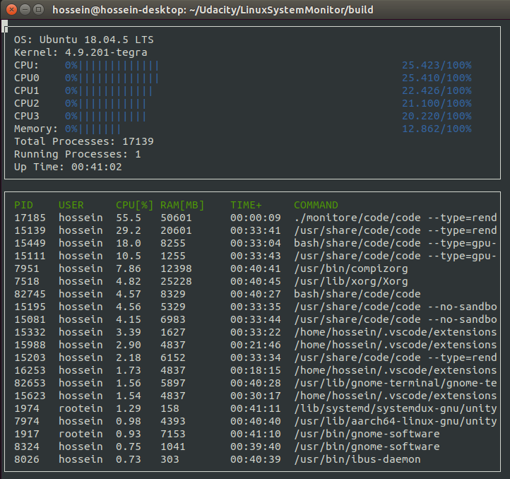
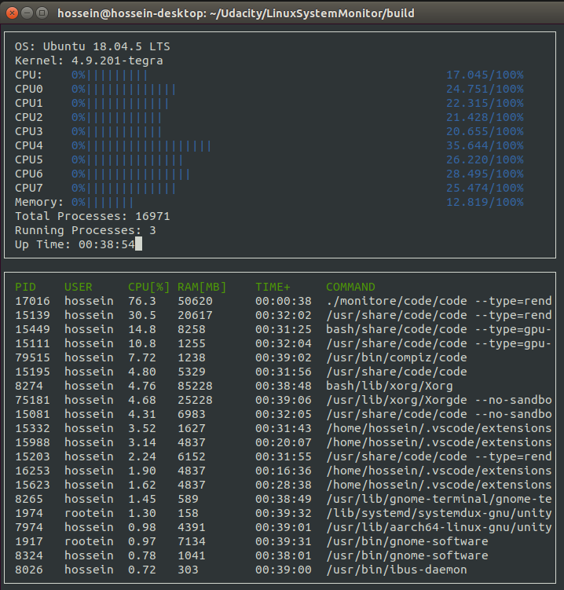
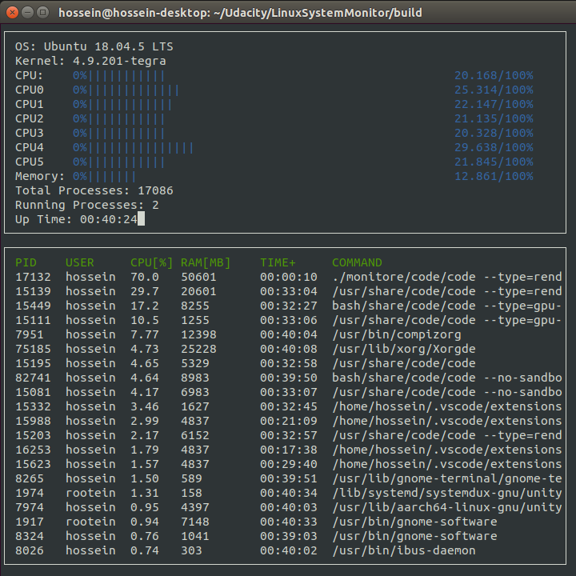

# Linux System Monitor
This project creates a detailed system monitor for Linux similar to htop.

| |
|:--:| 
| *A snapshot of project running on Jetson AGX Xavier* |

## Dependency: "ncurses" library
[ncurses](https://www.gnu.org/software/ncurses/) is a library that facilitates text-based graphical output in the terminal. This project relies on ncurses for display output.

ncurses can be installed using: `sudo apt install libncurses5-dev libncursesw5-dev`

## Make
This project uses [Make](https://www.gnu.org/software/make/). The Makefile has four targets:
* `build` compiles the source code and generates an executable
* `format` applies [ClangFormat](https://clang.llvm.org/docs/ClangFormat.html) to style the source code
* `debug` compiles the source code and generates an executable, including debugging symbols
* `clean` deletes the `build/` directory, including all of the build artifacts

## Examples of opertaion:

### Jetson AGX Xavier is set to MODE 30W All Cores 
In this power mode all 8 processors are active

| |
|:--:| 
| *Sysem monitor clearly showing the cpu utilization of all 8 processors in addition the the aggregate utilization* |

### Jetson AGX Xavier is set to MODE 30W 6 Cores 
In this power mode only 6 processors are active

| |
|:--:| 
| *Sysem monitor showing the cpu utilization of 6 processors in addition the the aggregate utilization* |

### Jetson AGX Xavier is set to MODE 15W Desktop 
In this power mode only 4 processors are active

| |
|:--:| 
| *Sysem monitor showing the cpu utilization of 4 processors in addition the the aggregate utilization* |

